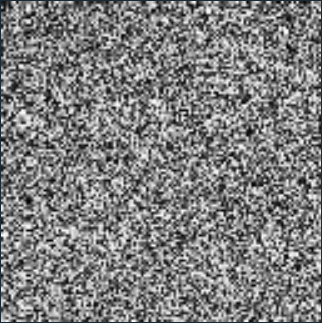
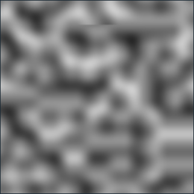
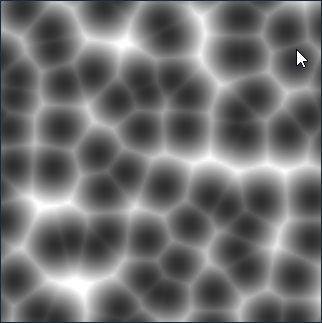
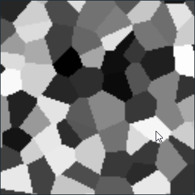
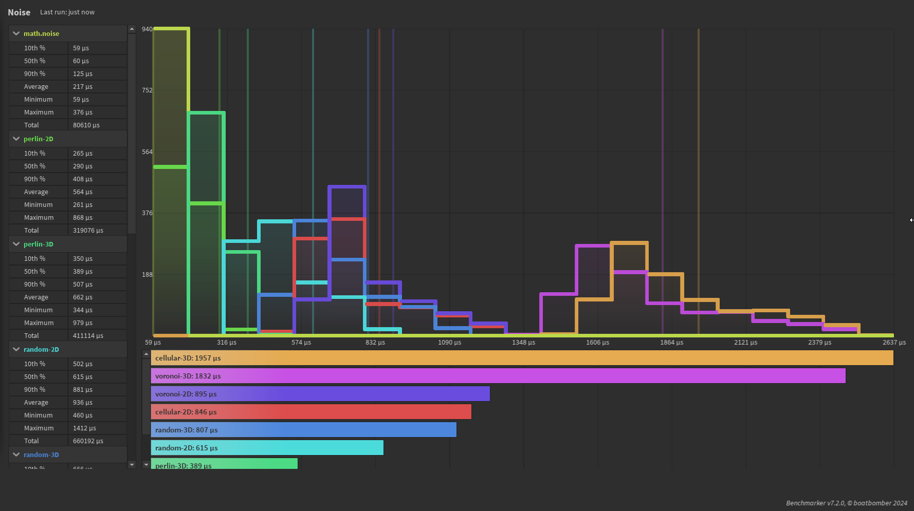

# Usage

```lua
local noise = Noise.new(12345)
local value = noise:Perlin(1, 2) -- a value from 0 to 1 (ish)
```

## Random



## Perlin



## Worley / Cellular



## Voronoi



# Benchmark

Each map was sampled 32 times, including math.noise, to determine how long each of them took. Some maps have built in optimizations for when only x and y are provided.



As you can see, math.noise is 2x faster than anything else. The perlin implementation is literally a translation of the official luau source code, so it's unsurprisingly running the fastest. The only reason you'd used this over math.noise is if you want deterministic seed control. The random noise map is just a bunch of Random datatypes in a trenchcoat, so it's also fairly fast.

In general, the more complex maps require around 50-60 microseconds to run per call - not a dealbreaker, but you'll want to be smart when you use them. They do cache their outputs though, so calling a repeat set of conditions can be faster than math.noise.

